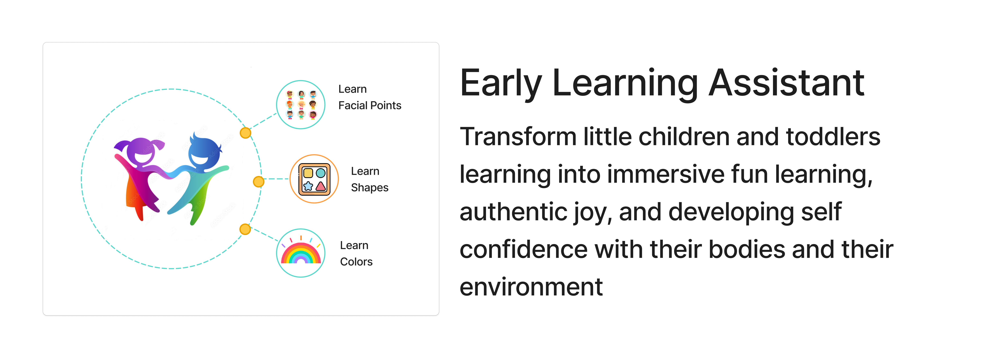

# Early Learning Assistant

**Early Learning Assistant** is a real-time interactive educational app built with Python. It uses your computer’s **camera** and **speakers** to guide users—especially young learners—through playful actions and tasks. The app uses **MediaPipe** to detect **faces** (eyes, nose, mouth, ears) and **hands**, enabling visual and gesture-based interaction.

---

## 🧠 How It Works

- 📷 Captures real-time video using your **computer's webcam**
- 🧍 Detects **facial landmarks** (eyes, ears, nose, mouth) using **MediaPipe Face Mesh**
- ✋ Detects **hand landmarks** using **MediaPipe Hands**
- 🔊 Uses **system speakers** for interactive audio feedback (if implemented in your `main.py`)
- 💡 Designed for use in **early learning** environments to promote learning of body face parts

---

## 🛠 Prerequisites

Make sure you have:

- A working **webcam** and **speaker**
- Python **3.10.13 or newer** installed  
  Check with:
# Python 3.10.13 Virtual Environment Setup

This project enforces **Python 3.10.13** inside a virtual environment, without modifying or relying on the system-wide Python version. All setup steps are handled automatically via platform-specific scripts.

---

## ✅ Supported Platforms

- macOS (x86_64 or ARM)
- Windows 10+

---

## 🚀 Setup Instructions

### 1. Clone or download the project.

```bash
> git clone <your-repo-url>
> cd <project-folder>
````

### 2. Execute the setup script.
- For **macOS**:
```bash
>  setup-macos.sh
```
- For **Windows**:
```bash
>  setup-windows.bat
```

## Run the app:
```bash

> python main.py
```

## Remarks:
You might be prompted to allow the camera, speaker access. Make sure to allow it for the app to work properly.
